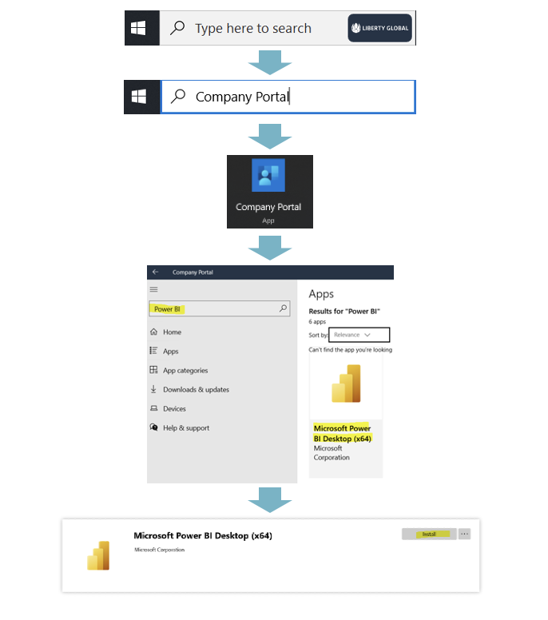

---
lab:
    title: 'Set up your PowerBI environment'
    module: 'Set up your PowerBI environment'
---

## Installation instructions

> &#128221; The instructions below are for a Windows 11 computer. Connecting from a different OS may not result in the same experience.

### Power BI Desktop

1. Download and install from the internal store following the instructions. 

## Resource files download

- All setup and resource files can be [downloaded](https://github.com/nephoseu/LGPowerBI/raw/main/AllfilesDownload.zip).
  - Extract the 'PBI_Training' folder to C:/'. 

> &#128221; The prepared reports assume files are located in the 'C:\PBI_Training'. In case you will be using another folder, **ask one of the proctors for help** to change the reports to point to files on your PC.

## SQL Server Database Engine

1. The lab connects to a SQL Server hosted in the cloud. If you are prompted to provide credentials to sql database, use the following:

    - Username: lguser
    - Password: lgpassword1!
    - Server: lglobal2.database.windows.net

