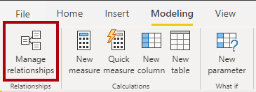
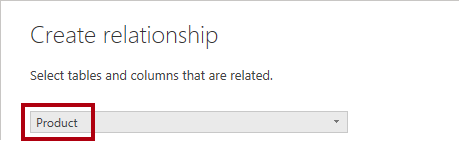
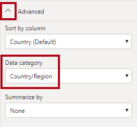

---
lab:
    title: '[Lab 03] Relationships, properties and hiearchies'
    module: 'Relationships, properties and hiearchies'
---

# Relationships, properties and hiearchies

## **Lab story**

In this lab, you'll commence developing the data model. It will involve creating relationships between tables, and then configuring table and column properties to improve the friendliness and usability of the data model. You'll also create hierarchies and create quick measures.

In this lab you learn how to:

- Create model relationships
- Configure table and column properties
- Create hierarchies

**This lab should take approximately 45 minutes.**

## **Create model relationships**

In this task, you'll create model relationships. The file was configured to not identify relationships between tables in the previous labs. This isn't the default setting, but is recommended to prevent extra work creating the correct relationships for your model.

*Important: The labs use a shorthand notation to reference a field. It will look like this: **Product \| Category**. In this example, **Product** is the table name and **Category** is the field name.*

1. In Power BI Desktop, at the left, select the **Model** view icon.

     

1. If you don't see all seven tables, scroll horizontally to the right, and then drag and arrange the tables more closely together so they can all be seen at the same time.

    > *Tip: You can also use the zoom control located at the bottom of the window.*

1. To return to Report view, at the left, select the **Report** view icon.

     

1. To view all table fields, in the **Data** pane, right-click an empty area, and then select **Expand All**.

1. To create a table visual, in the **Data** pane, from inside the **Product** table, check the **Category** field.

1. To add another column to the table, in the **Data** pane, check the **Sales \| Sales** field.

1. Notice that the table visual lists four product categories, and that the sales value is the same for each, and the same for the total.

	> *The issue is that the table is based on fields from different tables. The expectation is that each product category displays the sales for that category. However, because there isn’t a model relationship between these tables, the **Sales** table isn't filtered. You’ll now add a relationship to propagate filters between the tables.*

     

1. On the **Modeling** ribbon tab, from inside the **Relationships** group, select **Manage Relationships**.

     

1. In the **Manage Relationships** window, notice that no relationships are yet defined.

1. To create a relationship, select **New Relationship**.

1. In the **Create Relationship** window, in the first dropdown list, select the **Product** table.

     

1. In the second dropdown list (beneath the **Product** table grid), select the **Sales** table.

     

1. Notice the **ProductKey** columns in each table have been automatically selected.

	> *The columns were selected because they share the same name and data type. You may need to find matching columns with different names in real data.*

1. In the **Cardinality** dropdown list, notice that **One To Many (1:*)** is selected.

	> *The cardinality was automatically detected, because Power BI understands that the **ProductKey** column from the **Product** table contains unique values. One-to-many relationships are the most common cardinality, and all relationship you create in this lab will be this type.*

1. In the **Cross Filter Direction** dropdown list, notice that **Single** is selected.

	> *Single filter direction means that filters propagate from the “one side” to the “many side”. In this case, it means filters applied to the **Product** table will propagate to the **Sales** table, but not in the opposite direction.*

1. Notice that the **Mark This Relationship Active** is checked.

	> *Active relationships propagate filters. It’s possible to mark a relationship as inactive so filters don’t propagate. Inactive relationships can exist when there are multiple relationship paths between tables. In this case, model calculations can use special functions to activate them.*

1. Select **OK**, notice in the **Manage Relationships** window that the new relationship is listed, and then select **Close**.

1. Notice that in Model View, there's now a connector between the two tables (it doesn't matter if the tables are positioned next to each other).
    1. You can interpret the cardinality that is represented by the **1** and **(*)** indicators.
    1. Filter direction is represented by the arrow head.
    1. A solid line represents an active relationship; a dashed line represents an inactive relationship.
    1. Hover the cursor over the relationship to highlight the related columns.

     

     There’s an easier way to create a relationship. In the model diagram, you can drag and drop columns to create a new relationship.

1. To create a new relationship using a different technique, from the **Reseller** table, drag the **ResellerKey** column onto the **ResellerKey** column of the **Sales** table.

	Tip: Sometime a column doesn’t want to be dragged. If this situation arises, select a different column, and then select the column you intend to drag again, and then try again. Ensure that you see the new relationship added to the diagram.

     

1. Use the new technique to create the following two model relationships:

     - **Region \| SalesTerritoryKey** to **Sales \| SalesTerritoryKey**
     - **Salesperson \| EmployeeKey** to **Sales \| EmployeeKey**

1. In the diagram, arrange the tables so that the **Sales** table is positioned in the center of the diagram, and the related tables are arranged about it. Position the disconnected tables to the side.

     

1. In the report view, notice that the table visual updated to display different values for each product category.

	> *Filters applied to the **Product** table now propagate to the **Sales** table.*

     

1. Save the Power BI Desktop file.

## **Configure Tables**

In this exercise you'll configure each table by creating hierarchies, and hiding, formatting, and categorizing columns.

## **Configure the Product table**

In this task, you'll configure the **Product** table.

1. In Model view, in the **Data** pane, if necessary, expand the **Product** table to reveal all fields.

1. To create a hierarchy, in the **Data** pane, right-click the **Category** column, and then select **Create Hierarchy**.

     

1. In the **Properties** pane (to the left of the **Data** pane), in the **Name** box, replace the text with **Products**.

1. To add the second level to the hierarchy, in the **Properties** pane, in the **Hierarchy** dropdown list, select **Subcategory** (you might need to scroll down inside the pane).

1. To add the third level to the hierarchy, in the **Hierarchy** dropdown list, select **Product**.

1. To complete the hierarchy design, select **Apply Level Changes**.

     

 	> *Tip: Don’t forget to select **Apply Level Changes**—it’s a common mistake to overlook this step.*

1. In the **Data** pane, notice the **Products** hierarchy.

     

1. To reveal the hierarchy levels, expand the **Products** hierarchy.

     

1. To organize columns into a display folder, in the **Data** pane, first select the **Background Color Format** column.

1. While pressing the **Ctrl** key, select the **Font Color Format** column.

1. In the **Properties** pane, in the **Display Folder** box, enter **Formatting**.

     

1. In the **Data** pane, notice that the two columns are now inside a folder.
    
   > *Display folders are a great way to declutter tables—especially for tables that comprise many fields. They're logical presentation only.*

     

## **Configure the Region table**

In this task, you'll configure the **Region** table.

1. In the **Region** table, create a hierarchy named **Regions**, with the following three levels:

     - Group
     - Country
     - Region

     

1. Select the **Country** column (not the **Country** hierarchy level).

1. In the **Properties** pane, expand the **Advanced** section (at the bottom of the pane), and then in the **Data Category** dropdown list, select **Country/Region**.

	> *Data categorization can provide hints to the report designer. In this case, categorizing the column as country or region provides more accurate information to Power BI when it renders a map visualization.*

     

## **Configure the Reseller table**

In this task, you'll configure the **Reseller** table.

1. In the **Reseller** table, create a hierarchy named **Resellers**, with the following two levels:

     - Business Type
     - Reseller

1. Create a second hierarchy named **Geography**, with the following four levels:

     - Country-Region
     - State-Province
     - City
     - Reseller

1. Set the **Data Category** for the **Country-Region**, **State-Province**, and **City** columns (not the hierarchy level) to **Country/Region**, **State or Province**, and **City**, respectively.

## **Configure the Sales table**

In this task, you'll configure the **Sales** table.

1. In the **Sales** table, select the **Cost** column.

1. In the **Properties** pane, in the **Description** box, enter: *Based on standard cost*.

	> *Descriptions can be applied to tables, columns, hierarchies, or measures. In the **Data** pane, description text is revealed in a tooltip when a report author hovers their cursor over the field.*

1. Select the **Quantity** column.

1. In the **Properties** pane, from inside the **Formatting** section, slide the **Thousands Separator** property to **Yes**.

1. Select the **Unit Price** column.

1. In the **Properties** pane, from inside the **Formatting** section, set the **Decimal Places** property to **2**.

1. In the **Advanced** group (you may need to scroll down to locate it), in the **Summarize By** dropdown list, select **Average**.

	> *By default, numeric columns will summarize by summing values together. This default behavior isn't suitable for a column like **Unit Price**, which represents a rate. Setting the default summarization to average will produce a meaningful result.*

## **Bulk update properties**

In this task, you'll update multiple columns using single bulk updates. You'll use this approach to hide columns, and format column values.

1. In the **Data** pane, select the **Product \| ProductKey** column.

1. While pressing the **Ctrl** key, select the following 13 columns (spanning multiple tables):

     - Region \| SalesTerritoryKey
     - Reseller \| ResellerKey
     - Sales \| EmployeeKey
     - Sales \| ProductKey
     - Sales \| ResellerKey
     - Sales \| SalesOrderNumber
     - Sales \| SalesTerritoryKey
     - Salesperson \| EmployeeID
     - Salesperson \| EmployeeKey
     - Salesperson \| UPN
     - SalespersonRegion \| EmployeeKey
     - SalespersonRegion \| SalesTerritoryKey
     - Targets \| EmployeeID

1. In the **Properties** pane, slide the **Is Hidden** property to **Yes**.

	> *The columns were hidden because they’re either used by relationships or will be used in row-level security configuration or calculation logic.*

 	> *You’ll use the **SalesOrderNumber** in a calculation in the **Create DAX Calculations in Power BI Desktop** lab.*

1. Multi-select the following three columns:

     - Product \| Standard Cost
     - Sales \| Cost
     - Sales \| Sales

1. In the **Properties** pane, from inside the **Formatting** section, set the **Decimal Places** property to **0** (zero).

### **Finish up**

In this task, you'll complete the lab.

Save the Power BI Desktop file, and select **Apply Later** if prompted to apply queries.

