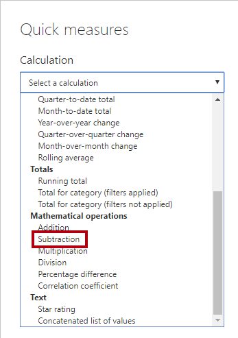
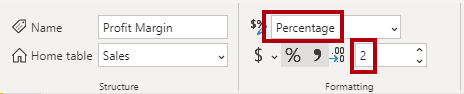
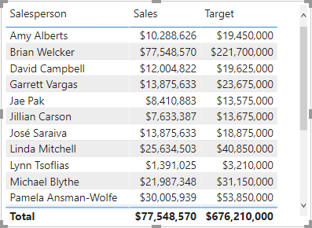

---
lab:
    title: '[Lab 03b] Optional challenges - Data Model in Power BI Desktop'
    module: ''
---

## **Review the Model Interface**

In this exercise you'll switch to Report view, and review the model interface.

## **Review the model interface**

In this task you'll switch to Report view, and review the model interface.

1. Switch to Report view.

1. In the **Data** pane, notice the following:

     - Columns, hierarchies and their levels are fields, which can be used to configure report visuals
     - Only fields relevant to report authoring are visible
     - The **SalespersonRegion** table isn't visible—because all of its fields are hidden
     - Spatial fields in the **Region** and **Reseller** table are adorned with a spatial icon
     - Fields adorned with the sigma symbol (Ʃ) will summarize, by default
     - A tooltip appears when hovering the cursor over the **Sales \| Cost** field

1. Expand the **Sales \| OrderDate** field, and then notice that it reveals a date hierarchy.

	> *The **Targets \| TargetMonth** field delivers a similar hierarchy. These hierarchies weren't created by you. They were created automatically. There's a problem, however. The Adventure Works financial year commences on July 1 of each year. But, in these automatically created date hierarchies, the date hierarchy year commences on January 1 of each year.*

     

 You’ll now turn off this automatic behavior. In the **Create DAX Calculations in Power BI Desktop** lab, you’ll use DAX to create a date table, and configure it define the Adventure Works’ calendar.

1. To turn off auto/date time, Navigate to **File > Options and Settings > Options > Current File** group, and select **Data Load**.
    1. In the **Time Intelligence** section, uncheck **Auto Date/Time**.

     

1. In the **Data** pane, notice that the date hierarchies are no longer available.

     

## **Create Quick Measures**

In this exercise, you'll create two quick measures.

## **Create quick measures**

In this task, you'll create two quick measures to calculate profit and profit margin.

*A quick measure creates the calculation formula for you. They’re easy and fast to create for simple and common calculations. You’ll create measures without using this tool in the **Create DAX Calculations in Power BI Desktop** lab.*

1. In the **Data** pane, right-click the **Sales** table, and then select **New Quick Measure**.

     

1. In the **Quick Measures** window, in the **Calculation** dropdown list, from inside the **Mathematical Operations** group, select **Subtraction**.

     

1. In the **Data** pane of the **Quick Measures** window, expand the **Sales** table.

1. Drag the **Sales** field into the **Base Value** box.

1. Drag the **Cost** field into the **Value to Subtract** box.

     

1. In the **Data** pane, inside the **Sales** table, notice that new measure.
    1. *Measures use the calculator icon.*

     

1. To rename the measure, right-click it, select **Rename**, then rename to **Profit**.

	> *Tip: To rename a field, you can also double-click it, or select it and press **F2**.*

1. In the **Sales** table, add a second quick measure, based on the following requirements:

     - Use the **Division** mathematical operation
     - Set the **Numerator** to the **Sales \| Profit** field
     - Set the **Denominator** to **Sales \| Sales** field
     - Rename the measure as **Profit Margin**

1. Ensure the **Profit Margin** measure is selected, and then on the **Measure Tools** contextual ribbon, set the format to **Percentage**, with two decimal places.

     

1. To test the two measures, first select the **table** visual on the report page.

1. In the **Data** pane, check the two measures.

     

1. Select and drag the right guide to widen the table visual.

     

1. Verify that the measures produce reasonable results that are correctly formatted.

     

## **Create a many-to-many relationship**

In this task, you'll create a many-to-many relationship between the **Salesperson** table and the **Sales** table.

 *The labs use a shorthand notation to reference a field. It will look like this: **Salesperson \| Salesperson** . In this example, **Salesperson**  is the table name and **Salesperson**  is the field name.*

1. In Power BI Desktop, in Report view, in the **Data** pane, check the follow two fields to create a **table** visual.

     - Salesperson \| Salesperson
     - Sales \| Sales

     

    > *The table displays sales made by each salesperson. However, there’s another relationship between salespeople and sales. Some salespeople belong to one, two, or possibly more sales regions. In addition, sales regions can have multiple salespeople assigned to them.*

    > *From a performance management perspective, a salesperson’s sales (based on their assigned territories) need to be analyzed and compared with sales targets. You’ll create relationships to support this analysis in the next exercise.*

1. Notice that **Michael Blythe** has sold almost $9 million.

1. Switch to Model view, then drag the **SalespersonRegion** table to position it between the **Region** and **Salesperson** tables.

1. Use the drag-and-drop technique to create the following two model relationships:

     - **Salesperson \| EmployeeKey** to **SalespersonRegion \| EmployeeKey**
     - **Region \| SalesTerritoryKey** to **SalespersonRegion \| SalesTerritoryKey**

    > *The **SalespersonRegion** table can be considered to be a bridging table.*

1. Switch to Report view, and then notice that the visual hasn't updated—the sales result for Michael Blythe hasn't changed.

1. Switch back to Model view, and then follow the relationship filter directions (arrowhead) from the **Salesperson** table.

	> *Consider that the **Salesperson** table filters the **Sales** table. It also filters the **SalespersonRegion** table, but it doesn't continue by propagating filters to the **Region** table (the arrowhead is pointing the wrong direction).*

     

1. To edit the relationship between the **Region** and **SalespersonRegion** tables, double-click the relationship.

1. In the **Edit Relationship** window, in the **Cross Filter Direction** dropdown list, select **Both**.

1. Check the **Apply Security Filter in Both Directions** checkbox, then select OK.

     

1. Notice that the relationship has a double arrowhead now.

     

1. Switch to Report view, and then notice that the sales values have still not changed.

	> *The issue now relates to the fact that there are two possible filter propagation paths between the **Salesperson** and **Sales** tables. This ambiguity is internally resolved, based on a “least number of tables” assessment. To be clear, you shouldn’t design models with this type of ambiguity—the issue will be addressed in part later in this lab, and by the completion of the **Create DAX Calculations in Power BI Desktop** lab.*

1. Switch to Model view to force filter propagation via the bridging table. Edit (double-click) the relationship between the **Salesperson** and **Sales** tables.

1. In the **Edit Relationship** window, uncheck the **Make This Relationship Active** checkbox, and select **OK**.

	> *The filter propagation will now follow the only active path.*

1. In the diagram, notice that the inactive relationship is represented by a dashed line.

     

1. Switch to Report view, and then notice that the sales for Michael Blythe are now nearly $22 million.

     

1. Notice also, that the sales for each salesperson—if added—would exceed the table total.

    > *It’s a common observation of a many-to-many relationship due to the double, triple, etc. counting of regional sales results. Consider Brian Welcker, the second salesperson listed. His sales amount equals the total sales amount. It’s the correct result due to the fact the he’s the Director of Sales; his sales are measured by the sales of all regions.*

    > *While the many-to-many relationship is now working, it’s now not possible to analyze sales made by a salesperson (because the relationship is inactive). You’ll be able to reactivate the relationship when you introduce a calculated table that will allow analyzing sales made in the sales region(s) assigned to the salesperson (for performance analysis) in the **Create DAX Calculations in Power BI Desktop** lab.*

1. Switch to Modeling view, and then in the diagram, select the **Salesperson** table.

1. In the **Properties** pane, in the **Name** box, replace the text with **Salesperson (Performance)**.

> *The renamed table now reflects its purpose: it’s used to report and analyze the performance of salespeople based on the sales of their assigned sales regions.*

## **Relate the Targets table**

In this task, you'll create a relationship to the **Targets** table

1. Create a relationship from the **Salesperson (Performance) \| EmployeeID** column and the **Targets \| EmployeeID** column.

1. In Report view, add the **Targets \| Target** field to the table visual.

1. Resize the table visual so all columns are visible.

     

 > *It’s now possible to visualize sales and targets—but take care for two reasons. First, there’s no filter on a time period, and so targets also include future target amounts. Second, targets aren't additive, and so the total shouldn't be displayed. They can either be disabled by formatting the visual or removed by using calculation logic. You’ll follow the second approach by creating a target measure in the **Create Advanced DAX Calculations in Power BI Desktop** lab that will return BLANK when more than one salesperson is filtered.*

### **Finish up**

In this task, you'll complete the lab.

Save the Power BI Desktop file, and select **Apply Later** if prompted to apply queries.
