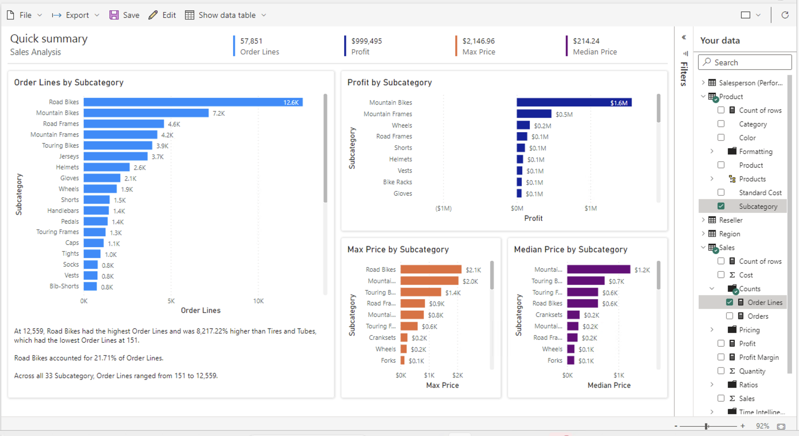

---
lab:
    title: '[Lab 05b] Optional challenges - Design a Report in Power BI Desktop'
    module: ''
---

# Design a Report in Power BI Desktop

**There are no step-by-step guidance, try to find solution on your own** 
 

## **Use create automated report**

In this task, you'll use the feature to automatically create a report based on dataset

1. In PowerBI Service, in your workspace, find a datatet for the report you just published

1. Use Auto-create report

1. Add Sales data, profit margin and dates

1. Save a report as "Quick Analysis