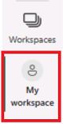
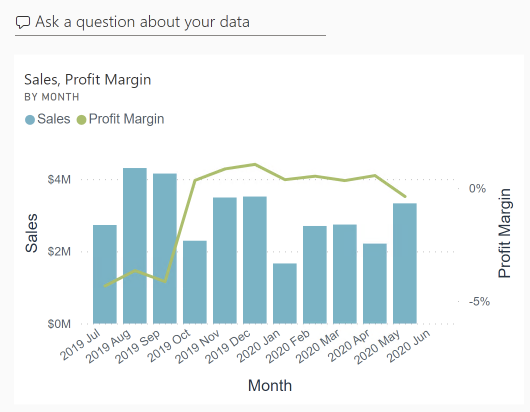
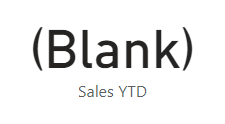
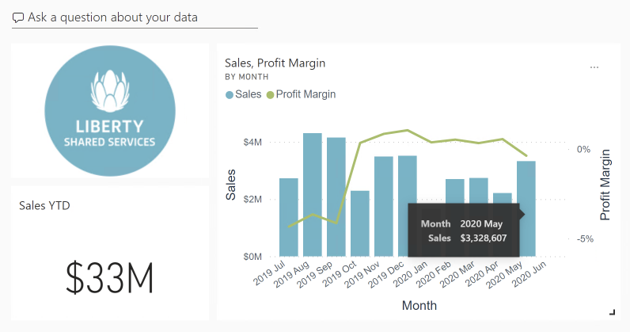
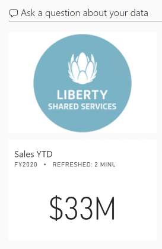

---
lab:
    title: '[Lab 07] PowerBI Service - Dashboards'
    module: 'PowerBI Service - Dashboards, Alerts, Sharing, Security'
---

# **PowerBI Service - Dashboards, Alerts, Sharing, Security**

## **Lab story**

In this lab, you'll create the **Sales Monitoring** dashboard in the Power BI service using an existing report.

In this lab you learn how to:

- Pin visuals to a dashboard
- Use Q&A to create dashboard tiles

**This lab should take approximately 45 minutes.**

## **Get started – Sign in**

In this task, you'll set up the environment for the lab by signing in to Power BI.

*Note: If you've already signed in to Power BI, skip to the next task.*

1. To open Microsoft Edge, on the taskbar, select the Microsoft Edge program shortcut.

     

1. In the Microsoft Edge browser window, navigate to **https://app.powerbi.com**.

    > *Tip: You can also use the Power BI Service favorite on the Microsoft Edge favorites bar.*

1. Complete the sign-in process with your organizational credentials (or those provided to you). If prompted by Microsoft Edge to stay signed in, select **Yes**.

1. In the Microsoft Edge browser window, in the Power BI service, in the **Navigation** pane, expand **My Workspace**. Leave the Microsoft Edge browser window open.

     

## **Get started – Open report**

In this task, you'll set up the environment for the lab by opening the starter report.

*Important: If you're continuing on from the previous lab (and you completed that lab successfully), don't complete this task; instead, continue from the next task.*

1. Open Power BI Desktop.
    
	> *By default, the Getting Started dialog box opens in front of Power BI Desktop. Sign-in, and then close the pop-up.*

    

1. To open the starter Power BI Desktop file, select the **File > Open Report > Browse Reports**.

1. In the **Open** window, navigate to the **C:\PBI_Training\StarterFiles\Lab_07** folder, and open the **Sales Analysis** file.

1. Close any informational windows that may open.

1. Notice the yellow warning message beneath the ribbon. *This message alerts you to the fact that the queries haven't been applied to load as model tables. You’ll apply the queries later in the lab.*
    
	> *To dismiss the warning message, at the right of the yellow warning message, select **X**.*

1. To create a copy of the file, go to **File > Save As** and save to **C:\PBI_Training\MySolution** folder.

1. If prompted to apply changes, select **Apply Later**.

## **Get started – Publish the report**

In this task, you'll set up the environment for the lab by creating a dataset. *If you've already published the dataset, please move to the next task.*

1. In the Microsoft Edge browser window, in the Power BI service, navigate to **My Workspace**.

1. Select **Upload > Browse**.

1. Navigate to **C:\PBI_Training\StarterFiles\Lab_07** folder.

1. Select the **Sales Analysis.pbix** file, and then select **Open**.

*If prompted to replace the dataset, select **Replace it**.*

## **Create a dashboard**

In this task, you'll create the **Sales Monitoring** dashboard. You'll pin a visual from the report, and add a tile based on an image data URI, and use Q&A to create a tile.

1. In the Power BI service, open the **Sales Analysis** report.

1. In the **Overview** page, set the **Year** slicer to **FY2020**.

    

1. Set the **Region** slicer to **Select All**.

	> *Pinned visuals are set with the filter context at time of pin. If the underlying visual changes, you'll need to update the dashboard tile as well. For time-based filters, it’s a better idea to use a relative date slicer (or, Q&A using a relative time-based question).*

1. To create a dashboard and pin a visual, hover the cursor over the **Sales and Profit Margin by Month** (column/line) visual, and select the pushpin.

    

1. In the **Pin to Dashboard** window, in the **Dashboard Name** box, enter **Sales Monitoring**, then select **Pin**.

    

1. Open **My Workspace** and open the **Sales Monitoring** dashboard.

1. Notice that the dashboard has a single tile.

    

1. To add a tile based on a question, at the top-left of the dashboard, select **Ask a Question About Your Data**.
    
	> *You can use the Q&A feature to ask a question, and Power BI will respond will a visual.*

    

1. Select any one of the suggested questions beneath the Q&A box, in blue boxes, and review the response.

1. Remove all text from the Q&A box, and enter the following: **Sales YTD**

1. Notice the response of **(Blank)**.
    
	> *You may recall you added the **Sales YTD** measure in the **Create Advanced DAX Calculations in Power BI Desktop** lab. This measure is a Time Intelligence expression and it so requires a filter on the **Date** table to produce a result.*

    

1. Extend the question with: **in year FY2020**.

1. Notice the response is now **$33M**.

    

1. To pin the response to the dashboard, at the top-right corner, select **Pin Visual**.

    

1. When prompted to pin the tile to the dashboard, select **Pin**.

1. To return to the dashboard, at the top-left corner, select **Exit Q&amp;A**.

1. To add the company logo, on the menu bar, select **Edit**, and then select **Add a Tile**.
    
	> *Using this technique to add a dashboard tile lets you enhance your dashboard with media, including web content, images, richly formatted text boxes, and video (using YouTube or Vimeo links).*

1. In the **Add a Tile** pane (located at the right), select the **Image** tile, then **Next**.

1. In the **Add Image Tile** pane, in the **URL** box, enter the complete URL  **https://nephossi.github.io/LGPowerBI/Instructions/Image/LGLogo.png**, and then **Apply**.
    
	> *You can embed an image by using its URL, or you can use a data URL, which embeds content inline.*

1. To resize the logo tile, drag the bottom-right corner, and resize the tile to become one unit wide, and two units high.
    
	> *Tile sizes are limited to a rectangular shape.*

1. Organize the tiles so that the logo appears at the top-left, with the **Sales YTD** tile beneath it, and the **Sales, Profit Margin** tile at the right.

    

## **Edit tile details**

In this task, you'll edit the details of two tiles.

1. Hover the cursor over the **Sales YTD** tile, and then at the top-right of the tile, select the ellipsis, and then select **Edit Details**.

    

1. In the **Tile Details** pane (located at the right), in the **Subtitle** box, enter **FY2020**, and then select **Apply**.

1. Notice that the **Sales YTD** tile displays a subtitle.

    

1. Edit the tile details for the **Sales, Profit Margin** tile.

1. In the **Tile Details** pane, in the **Functionality** section, check **Display Last Refresh Time**, and then **Apply**.

    

1. Notice that the tile describes the last refresh time (which done when loading the data model in Power BI Desktop).

*You’ll refresh the dataset in the next exercise. Depending on your data and report, you can do an adhoc data refresh anytime or set a schedule. However, scheduled refreshes require gateways that we aren't able to configure for this lab. So from Power BI Desktop, you'll perform a manual data refresh, and then upload the file to your workspace.*

### **Finish up**

In this task, you'll complete the lab.

1. Save the report and close your browser.
