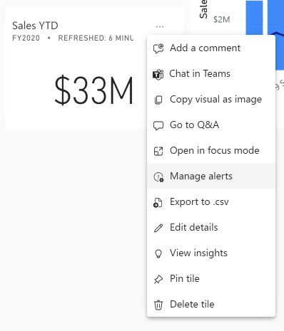
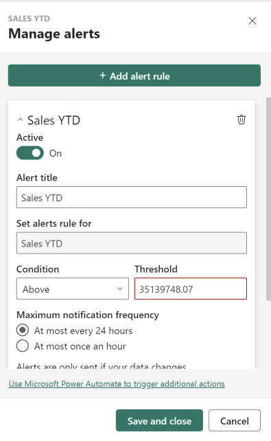
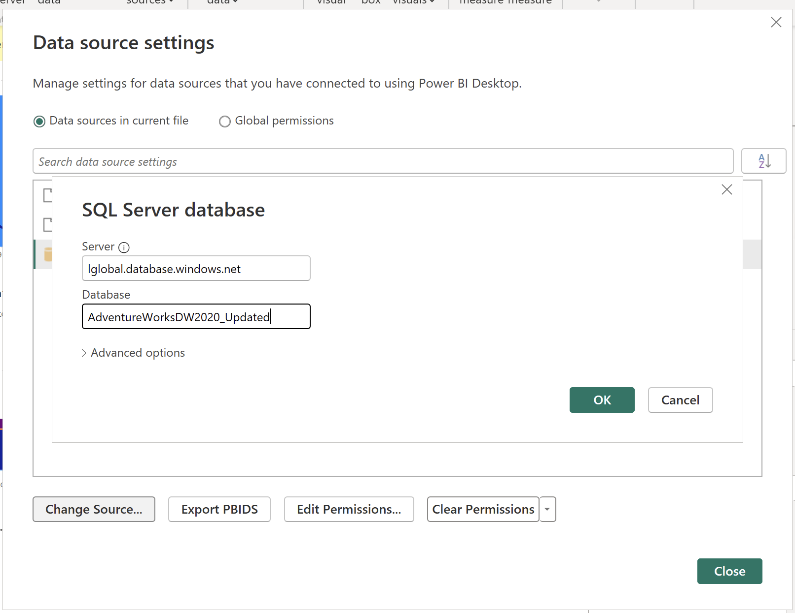
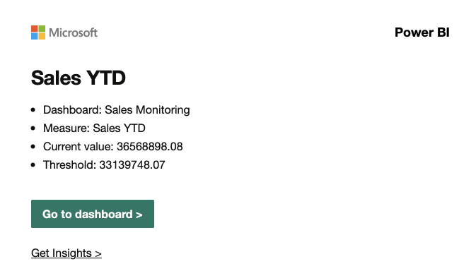
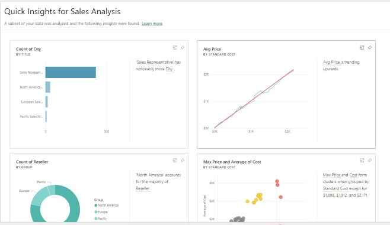

---
lab:
    title: '[Lab 07b] Optional challenges - Alerts, Sharing, Security'
    module: ''
---

# Design a Report in Power BI Desktop

## **Create an alert**

1. Hover the cursor over the **Sales YTD** tile, and then at the top-right of the tile, select the ellipsis, and then select **Manage Alerts**.

    

1. In the **Manage Alerts** pane (located at the right), click the **Add alert rule**, enter **35139748.07** undert Threshold, and then select **Save and Close**.

    

*If you want to use Power Automate to trigger additional actions, first you need to save the alert, and then click manage alerts on the tile*

## **Refresh the Dataset**

In this exercise, we will simulate data refresh. You'll update the dataset to point to another database, which includes sales order data for June 2020. You'll then open your Power BI Desktop file, change the datasource, and then upload the file to your workspace.

## **Update the lab database**

1. Open your file in PowerBI desktop

1. In top menu, under Transform Data select **Data source setting**

1. Select **lglobal.database.windows.net...** and Click **Change Source**. Type **AdventureWorksDW2020_Updated** in the database field. click OK and Close.

    

1. Click "Apply Changes".

1. In Power BI Desktop file, in the **Data** pane, right-click the **Sales** table, and then select **Refresh Data**.

    

1. When the refresh completes, save the Power BI Desktop file.

1. To publish the file to your workspace, on the **Home** ribbon tab, from inside the **Share** group, select **Publish** and then select **Select** to publish.

    

1. When prompted to replace the dataset, select **Replace**.

1. Close Power BI Desktop.

*The dataset in the Power BI service now has June 2020 sales data.*

### **Review the dashboard**

In this task, you'll review the dashboard to notice updated sales.

1. In the Microsoft Edge browser window, open Power BI service, and then review the **Sales Monitoring** dashboard in **My Workspace**.

2. In the **Sales, Profit Margin** tile, in line with the subtitle, notice that the data was **Refreshed: NOW**.

3. Notice also that there's now a column for **2020 Jun**.
    
	> *If you don’t see the June 2020 data, you might need to press **F5** to reload the web browser.*

    

4. You should have received an email alert notification.

    

## **Use automated insights**

**There are no step-by-step guidance, try to find solution on your own**

In this task, you'll use the feature to automatically create visualisations for dashboards

1. In PowerBI Service, in your workspace, find a dataset for the report

1. Use View Insights report

1. Create a new Dashboard with all cost related metrics ang graphs

## **Share the dataset**

**There are no step-by-step guidance, try to find solution on your own**

In this task, you'll share only the dataset with a co-worker

1. In PowerBI Service, in your workspace, find a dataset for the report

1. Through Manage permission, add an user who can build content with this dataset