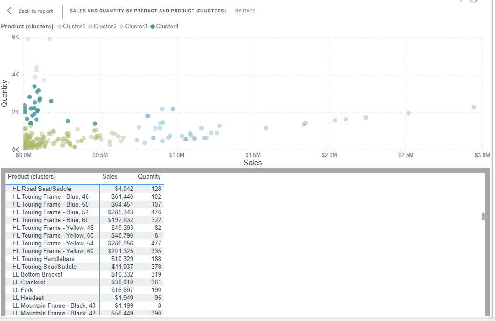
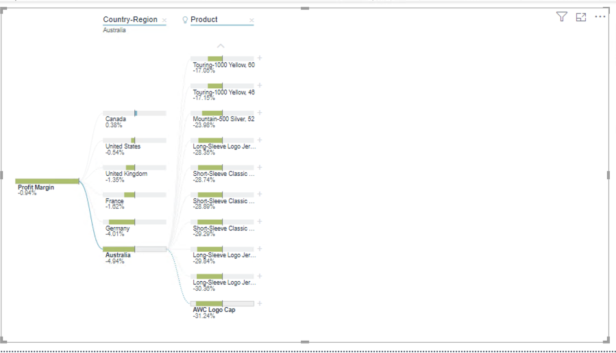
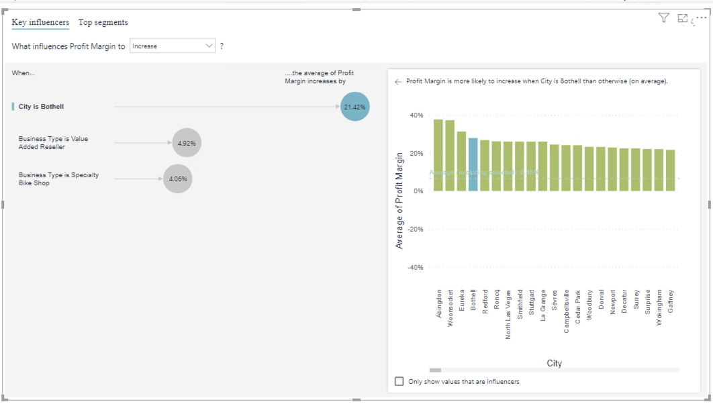
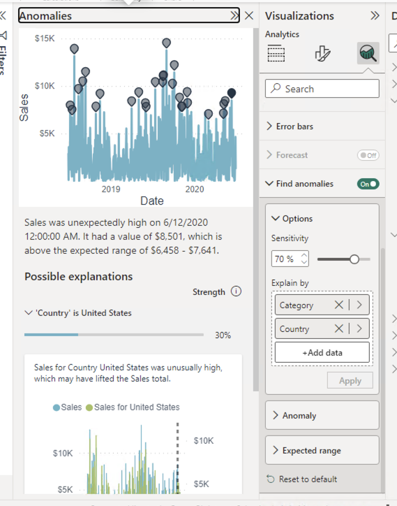
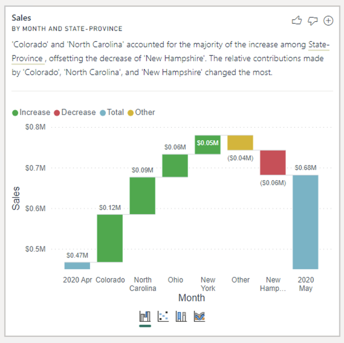

---
lab:
    title: '[Lab 08b] Optional challenges - PowerBI analytics and AI'
    module: ''
---

# **PowerBI analytics and AI**

## **Lab story**

In this lab, you'll create additional analysis in the **Sales Exploration** and **Sales Analysis** reports.

**There are no step-by-step guidance, try to find solution on your own**

### **Scatter chart with clusters**

1. Create a scatter chart with Sales, Quantity, then use the "automatically find clusters" feature. You will need to do it in the **Sales Analysis** report as it creates additional measure.

    

### **Decomposition tree**

1. Create a decomposition tree and find out, which product in which region has the lowest profit margin. 

    

### **Key influencers**

1. Analyze profit margin, explained by business type and reseller geography, and expanded by quantity. 
Find out which 3 factors influence the biggest profit margin increase

    

### **Anomalies**

1. Change the "Forecast" visual - turn off the forecast, and turn on find anomalies (by category and country)

    

### **Explain the ... feature**

1. In the "Sales Analysis" file, Create a new page - "May 2020 sales increase explanation"
Under "My performance", use "Analyze" feature to explain the jump in May 2020 sales data. Do the same for All up results on "Overveiw" page, and add 2 of the most important factors them to the new report page.

    

1. Add a Q&A visual, ask a question about highest sales by category in fy2020, and convert the visual into a multi-row card. Repeat with 2 more questions.

